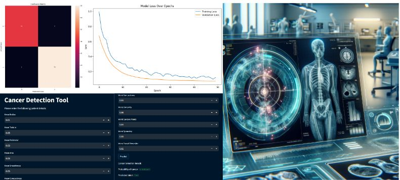

<h2 align="center">🌟 Day 3/366</h2>

  

<h3 align="center">AI's Impact on Oncology 🏥</h3>

AI's transformative impact on healthcare is making waves, especially in oncology, where it's revolutionizing early cancer detection and diagnosis. Leveraging the prowess of machine learning, AI systems are adept at sifting through complex medical data with remarkable accuracy and swiftness 🚀.

<h4 align="center">AI in Breast Cancer Detection 🎯</h4>

The deployment of AI in breast cancer detection is one of its standout applications. AI algorithms sift through medical images to spot subtle variations in tissue structures—potential harbingers of cancer at its nascent stage. Combined with diagnostic imaging like mammography, MRI, and CT scans, AI elevates the precision of cancer screenings, paving the way for timely medical intervention.

<h4 align="center">Predictive Analytics in Oncology 📈</h4>

AI's efficiency in digesting vast medical datasets allows it to unearth patterns that might escape the human eye. Predictive analytics in oncology evaluates individual risk factors for cancer, fostering personalized surveillance and preemptive health measures, indicating a shift towards preventative over curative medicine.

<h4 align="center">Interactive AI Learning with Google Colab 🔍</h4>

Take, for example, the Google Colab notebook "AI Cancer Detection." This interactive tool demonstrates how AI models are trained to detect cancerous cells, providing a simple yet enlightening peek into AI's role in medical diagnostics for beginners.

Reflecting on the Streamlit app visuals, we witness AI's training come to fruition. The model processes input features like Mean Radius, Texture, and Perimeter and outputs a probability score signalling cancer likelihood.

<h4 align="center">Join the Journey of AI in Healthcare 🌟</h4>

As AI's foray into healthcare continues, its potential to reshape early disease detection and prevention becomes more apparent. Join us in this fascinating exploration of a field where technology and health converge to create a brighter, healthier future.

  <em>Share your ideas and stay tuned every day for more updates!</em>

  <a href="https://lnkd.in/g_AZgQDN">Colab Link for Sample Project</a> | 
  <a href="https://lnkd.in/g2CAqRWt">GitHub Link</a>

  <em>#AIHealthcare #ML #AI #CancerDetection #EarlyDiagnosis #PredictiveAnalytics #PreventiveMedicine #HealthcareInnovation #Streamlit #GoogleColab #Spreadingaithroughsl</em>

